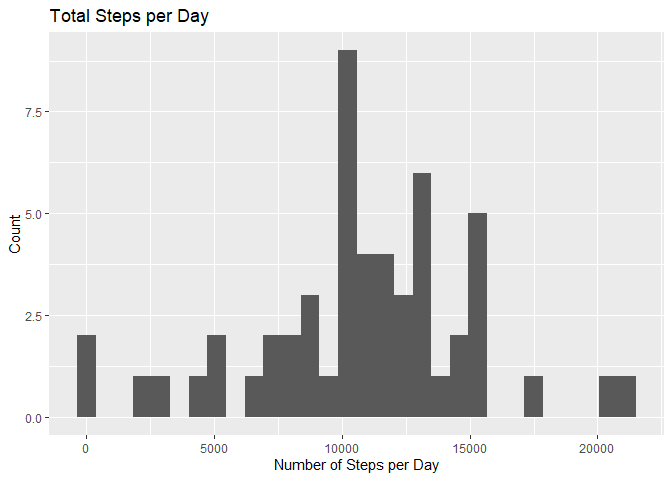
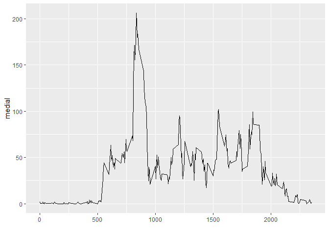
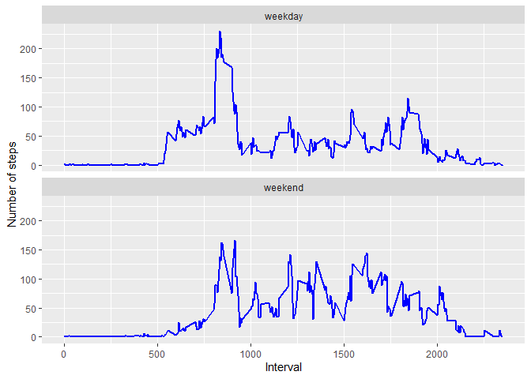

## INTRODUCTION

The following exercise makes use of data from a personal activity monitoring device to characterize the activity of an anonymous individual. This device collects data at 5 minute intervals through out the day. The data consists of two months of data from an anonymous individual collected during the months of October and November, 2012 and include the number of steps taken in 5 minute intervals each day.

## DATA

Data Source: Dataset: <https://d396qusza40orc.cloudfront.net/repdata%2Fdata%2Factivity.zip [52K]>

The variables included in this dataset are:

- steps: Number of steps taking in a 5-minute interval (missing values are coded as \color{red}{\verb|NA|}NA)
- date: The date on which the measurement was taken in YYYY-MM-DD format
- interval: Identifier for the 5-minute interval in which measurement was taken

## ASSIGNMENT


```r
# REQUIRED PACKAGES
library(dplyr)
```

```
## 
## Attaching package: 'dplyr'
```

```
## The following objects are masked from 'package:stats':
## 
##     filter, lag
```

```
## The following objects are masked from 'package:base':
## 
##     intersect, setdiff, setequal, union
```

```r
library(ggplot2)
library(knitr)
```


## Loading and preprocessing the data


```r
unzip("activity.zip")
factiv <- read.csv("activity.csv",header=TRUE)
factiv$steps<-as.numeric(factiv$steps)
factiv$date <- as.Date(factiv$date, "%Y-%m-%d")
```


## What is mean total number of steps taken per day?
Note: Missing values are ignored.

### Calculate the total number of steps taken per day


```r
# The sum function is applied over steps indexing by date in order to calculate totals by day. A new dataframe is built in order to be able to call ggplot
totals<-with(na.omit(factiv), tapply(X=steps, INDEX=date, FUN=sum, na.rm=TRUE)) 
totalsteps <- data.frame(cbind(rownames(totals), totals))
totalsteps$totals<-as.numeric(totalsteps$totals)

# The sum function is applied over steps indexing by interval to be used later
totalsI<-with(na.omit(factiv), tapply(X=steps, INDEX=interval, FUN=sum, na.rm=TRUE)) 
totalstepsI <- data.frame(cbind(rownames(totals), totals))
totalstepsI$totalsI<-as.numeric(totalsteps$totals)
summary(totalstepsI)
```

```
##       V1               totals             totalsI     
##  Length:53          Length:53          Min.   :   41  
##  Class :character   Class :character   1st Qu.: 8841  
##  Mode  :character   Mode  :character   Median :10765  
##                                        Mean   :10766  
##                                        3rd Qu.:13294  
##                                        Max.   :21194
```


### Make a histogram of the total number of steps taken each day

```r
# The plot is built using ggplot2
p1 <- ggplot(totalsteps, aes(x=totals)) + geom_histogram() +  labs(x = "Number of Steps per Day", y="Count", title="Total Steps per Day")
p1
```

```
## `stat_bin()` using `bins = 30`. Pick better value with `binwidth`.
```

<!-- -->


### Calculate and report the mean and median of the total number of steps taken per day

```r
promediosteps<-mean(totalsteps$totals)
medianasteps<-median(totalsteps$totals)
sdsteps <- sd(totalsteps$totals)
```

The mean of the total number of steps taken per day is 1.0766189\times 10^{4}
The median of the total number of steps taken per day is 1.0765\times 10^{4}


## What is the average daily activity pattern?


### Make a time series plot of the 5-minute interval (x-axis) and the average number of steps taken, averaged across all days (y-axis)


```r
# The mean of steps taken by interval is calculated applying the mean function
mediaI<-with(na.omit(factiv), tapply(X=steps, INDEX=interval, FUN=mean, na.rm=TRUE))
meanstepsI <- data.frame(cbind(rownames(mediaI), mediaI))
meanstepsI$mediaI<-as.numeric(meanstepsI$mediaI)
meanstepsI$interval<-as.numeric(meanstepsI$V1)

# The plot is built using ggplot2
p2 <- ggplot(meanstepsI, aes(x=interval, y=mediaI)) +  geom_line() +   xlab("")
p2
```

<!-- -->


### Which 5-minute interval, on average across all the days in the dataset, contains the maximum number of steps?

```r
maximo<-max(meanstepsI$mediaI, na.rm = TRUE)
if (meanstepsI$mediaI==maximo) {print(meanstepsI$interval)
}
```

```
## Warning in if (meanstepsI$mediaI == maximo) {: la condición tiene longitud > 1 y
## sólo el primer elemento será usado
```

```r
mxi <- filter(meanstepsI, meanstepsI$mediaI==maximo)
mx <- mxi$interval
```
The interval that contains the maximum number steps on average is 835

## Imputing missing values


### Calculate and report the total number of missing values in the dataset (i.e. the total number of rows with NAs)

```r
Nmissing <- sum(is.na(factiv))
```

The total number of missing values in the dataset is 2304

### Devise a strategy for filling in all of the missing values in the dataset.

NA values are replaced with the mean results for five minute intervals (averaged across all days)

### Create a new dataset that is equal to the original dataset but with the missing data filled in.


```r
factivbeta <- merge(x=factiv, y=meanstepsI, by="interval")
summary(factiv)
```

```
##      steps             date               interval     
##  Min.   :  0.00   Min.   :2012-10-01   Min.   :   0.0  
##  1st Qu.:  0.00   1st Qu.:2012-10-16   1st Qu.: 588.8  
##  Median :  0.00   Median :2012-10-31   Median :1177.5  
##  Mean   : 37.38   Mean   :2012-10-31   Mean   :1177.5  
##  3rd Qu.: 12.00   3rd Qu.:2012-11-15   3rd Qu.:1766.2  
##  Max.   :806.00   Max.   :2012-11-30   Max.   :2355.0  
##  NA's   :2304
```

```r
summary(meanstepsI)
```

```
##       V1                mediaI           interval     
##  Length:288         Min.   :  0.000   Min.   :   0.0  
##  Class :character   1st Qu.:  2.486   1st Qu.: 588.8  
##  Mode  :character   Median : 34.113   Median :1177.5  
##                     Mean   : 37.383   Mean   :1177.5  
##                     3rd Qu.: 52.835   3rd Qu.:1766.2  
##                     Max.   :206.170   Max.   :2355.0
```

```r
summary(factivbeta)
```

```
##     interval          steps             date                 V1           
##  Min.   :   0.0   Min.   :  0.00   Min.   :2012-10-01   Length:17568      
##  1st Qu.: 588.8   1st Qu.:  0.00   1st Qu.:2012-10-16   Class :character  
##  Median :1177.5   Median :  0.00   Median :2012-10-31   Mode  :character  
##  Mean   :1177.5   Mean   : 37.38   Mean   :2012-10-31                     
##  3rd Qu.:1766.2   3rd Qu.: 12.00   3rd Qu.:2012-11-15                     
##  Max.   :2355.0   Max.   :806.00   Max.   :2012-11-30                     
##                   NA's   :2304                                            
##      mediaI       
##  Min.   :  0.000  
##  1st Qu.:  2.486  
##  Median : 34.113  
##  Mean   : 37.383  
##  3rd Qu.: 52.835  
##  Max.   :206.170  
## 
```

```r
#Replacing the NA values with the mean for that 5-minute interval
factivbeta$steps2 <- ifelse(is.na(factivbeta$steps), factivbeta$mediaI, factivbeta$steps)
# View(factivbeta)
```


### Make a histogram of the total number of steps taken each day 


```r
totals2<-with(na.omit(factivbeta), tapply(X=steps2, INDEX=date, FUN=sum, na.rm=TRUE)) 
totalsteps2 <- data.frame(cbind(rownames(totals2), totals2))
totalsteps2$totals2<-as.numeric(totalsteps2$totals2)

# The plot is built using ggplot
p3 <- ggplot(totalsteps2, aes(x=totals2)) + geom_histogram() +  labs(x = "Number of Steps per Day", y="Count", title="Total Steps per Day (w/o NAs)")
p3
```

```
## `stat_bin()` using `bins = 30`. Pick better value with `binwidth`.
```

<!-- -->


### Calculate and report the mean and median total number of steps taken per day.

### Do these values differ from the estimates from the first part of the assignment? 


```r
# 
promediosteps2<-mean(totalsteps2$totals2)
medianasteps2<-median(totalsteps2$totals2)
sdsteps2 <- sd(totalsteps2$totals2)
```

The mean for the new dataset is 1.0766189\times 10^{4}
The median for the new dataset is 1.0765\times 10^{4}
The sd for the new dataset is 4269.1804927

The mean for the original dataset is 1.0766189\times 10^{4}
The median for the original dataset is 1.0765\times 10^{4}
The sd for the original dataset is 4269.1804927

### What is the impact of imputing missing data on the estimates of the total daily number of steps?

```r
difmean <- (promediosteps2-promediosteps)
difmedian <- (medianasteps2-medianasteps)
```

The difference between means is 0
The difference between medians is 0


## Are there differences in activity patterns between weekdays and weekends?

Note: The dataset with the filled in values is used for this exercise

### Create a new factor variable in the dataset with two levels – “weekday” and “weekend” indicating whether a given date is a weekday or weekend day.


```r
factivbeta <- factivbeta %>% mutate(typeofday = ifelse
          (weekdays(factivbeta$date)=="sábado" | 
              weekdays(factivbeta$date)=="domingo", "weekend", "weekday"))

#Aggregating(mean) steps over interval and day of week
intervalo<- aggregate(steps2 ~ interval + typeofday, data = factivbeta, FUN = mean, na.rm = TRUE)
```


### Make a panel plot containing a time series plot of the 5-minute interval (x-axis) and the average number of steps taken, averaged across all weekday days or weekend days (y-axis).


```r
ggplot(intervalo, aes(x=interval, y=steps2)) + 
  geom_line(color="blue", size=1) + 
  facet_wrap(~typeofday, nrow=2) +
  labs(x="Interval", y="Number of steps")
```

<!-- -->

